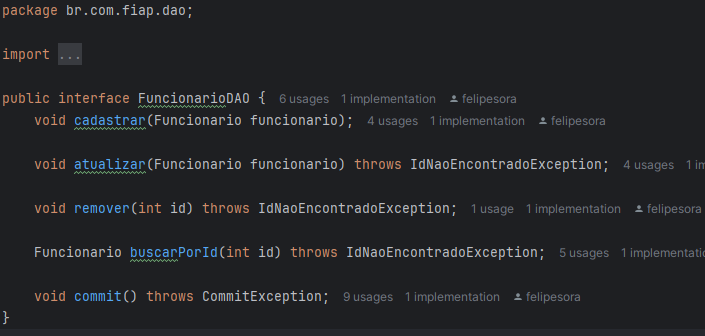

# CheckPoint 1 - Java Advanced

## Integrantes

* RM: 559165 Nome: Vinicius Ribeiro Nery Costa
* RM: 558209 Nome: Augusto Lope Lyra
* RM: 555462 Nome: Felipe Ulson Sora
* RM: 558515 Nome: Gustavo Bispo Cordeiro

## Explicação das Classes DAO

### Interface `FuncionarioDAO`

A interface `FuncionarioDAO` define os métodos para realizar operações de acesso a dados (CRUD) na entidade `Funcionario`. Ela garante que qualquer classe que implemente esta interface terá os seguintes métodos:

* `cadastrar(Funcionario funcionario)`: Cadastra um novo funcionário no banco de dados.
* `atualizar(Funcionario funcionario)`: Atualiza os dados de um funcionário existente.
* `remover(int id)`: Remove um funcionário do banco de dados pelo seu ID.
* `buscarPorId(int id)`: Busca um funcionário pelo seu ID.
* `commit()`: Salva as alterações no banco de dados.

### Classe `FuncionarioDaoImpl`

A classe `FuncionarioDaoImpl` implementa a interface `FuncionarioDAO` e fornece a implementação concreta dos métodos de acesso a dados usando o JPA (Java Persistence API).

* **Construtor:** Recebe um `EntityManager` como parâmetro, que é responsável por gerenciar a persistência dos objetos.
* **Métodos:** Implementa os métodos da interface `FuncionarioDAO` usando as funcionalidades do JPA, como `persist`, `merge`, `remove` e `find`.
* **Tratamento de Exceções:** Lança exceções personalizadas (`IdNaoEncontradoException` e `CommitException`) em casos de erro.

Essa abordagem com interface e implementação permite que o código seja mais flexível e fácil de testar, pois podemos trocar a implementação do DAO sem alterar o restante do código.

## Explicação das Classes de Entidade

### Interface `FuncionarioInterface`

A interface `FuncionarioInterface` define os métodos comuns a todos os tipos de funcionários:

* `calcularSalario()`: Calcula o salário do funcionário.
* `imprimirInformacao()`: Imprime as informações do funcionário.

### Classe `Funcionario`

A classe `Funcionario` é a classe base para todos os tipos de funcionários. Ela é anotada com `@Entity` para indicar que é uma entidade JPA e mapeada para a tabela `TAB_FUNCIONARIO`.

* **Herança:** Utiliza a estratégia `SINGLE_TABLE` para herança, com a coluna `cargo` como discriminador.
* **Atributos:** Possui atributos como `id`, `nome`, `horasTrabalhadas` e `valorHora`.
* **Métodos:** Implementa os métodos da interface `FuncionarioInterface` e fornece métodos getters e setters para os atributos.
* **Anotações JPA:** Utiliza anotações como `@Id`, `@Column`, `@GeneratedValue` e `@SequenceGenerator` para mapear os atributos para as colunas da tabela.
* **@PostPersist:** Possui um método anotado com `@PostPersist` para executar uma ação após a persistência do objeto.

### Classes de Funcionários Específicos

As classes `FuncionarioEstagiario`, `FuncionarioFreelancer`, `FuncionarioNoturno` e `FuncionarioSenior` herdam da classe `Funcionario` e representam tipos específicos de funcionários.

* **Discriminator Value:** Cada classe possui a anotação `@DiscriminatorValue` para definir o valor do discriminador `cargo`.
* **Atributos e Métodos Específicos:** Cada classe pode ter atributos e métodos específicos para o tipo de funcionário que representa.
* **Sobrescrita de Métodos:** Sobrescrevem os métodos `calcularSalario()` e `imprimirInformacao()` para implementar a lógica específica de cálculo de salário e impressão de informações.

Essa estrutura de classes de entidade permite representar diferentes tipos de funcionários com atributos e comportamentos específicos, mantendo a consistência e a organização do código.

## Explicação das Exceções

### `CommitException`

A classe `CommitException` é uma exceção personalizada que estende `RuntimeException`. Ela é lançada quando ocorre um erro durante a operação de commit no banco de dados.

* **Construtores:** Possui um construtor padrão que define a mensagem de erro como "Erro ao realizar o commit" e um construtor que permite definir uma mensagem de erro personalizada.

### `IdNaoEncontradoException`

A classe `IdNaoEncontradoException` é outra exceção personalizada que estende `RuntimeException`. Ela é lançada quando um funcionário com o ID especificado não é encontrado no banco de dados.

* **Construtor:** Possui um construtor que recebe uma mensagem de erro como parâmetro.

Essas exceções personalizadas ajudam a tornar o código mais robusto e fácil de depurar, pois fornecem informações específicas sobre os erros que podem ocorrer durante a execução do programa.

## Explicação da Classe de Serviço

### `FuncionarioService`

A classe `FuncionarioService` é responsável por encapsular a lógica de negócios relacionada às operações de CRUD de funcionários. Ela utiliza o `FuncionarioDAO` para acessar o banco de dados e o `Scanner` para interagir com o usuário.

* **Construtor:** Recebe um `FuncionarioDAO` e um `Scanner` como parâmetros.
* **Métodos:** Possui métodos para cadastrar, listar, atualizar e remover funcionários, além de outros métodos auxiliares.
* **Tratamento de Exceções:** Lida com exceções que podem ocorrer durante as operações, como `CommitException` e `IdNaoEncontradoException`.
* **Validação de Dados:** Realiza a validação dos dados fornecidos pelo usuário antes de realizar as operações no banco de dados.

Essa abordagem com uma classe de serviço separa a lógica de negócios da lógica de acesso a dados, tornando o código mais organizado, fácil de manter e testar.

## Explicação da Camada de Visualização (View)

### Classe `Main`

A classe `Main` é responsável por interagir com o usuário e chamar os métodos da classe `FuncionarioService` para realizar as operações de CRUD.

* **Método `main`:** O método `main` é o ponto de entrada do programa. Ele cria um `Scanner` para ler a entrada do usuário, instancia o `FuncionarioDAO` e o `FuncionarioService`, e exibe um menu com as opções de CRUD.
* **Loop Principal:** O programa entra em um loop infinito que exibe o menu e lê a opção do usuário.
* **Chamadas aos Métodos de `FuncionarioService`:** Dependendo da opção do usuário, o programa chama os métodos correspondentes da classe `FuncionarioService` para realizar as operações de CRUD.
* **Tratamento de Exceções:** O programa lida com exceções que podem ocorrer durante a entrada do usuário ou durante as operações de CRUD.

Essa abordagem com uma camada de visualização separada da lógica de negócios torna o código mais modular e fácil de manter, pois permite que a interface do usuário seja alterada sem afetar a lógica de negócios.

## Dependências do Projeto

O projeto utiliza o Maven para gerenciar suas dependências. As dependências estão definidas no arquivo `pom.xml`.

### `pom.xml`

O arquivo `pom.xml` define as dependências do projeto. As principais dependências utilizadas são:

* **`hibernate-core`:** Esta dependência fornece a implementação do Hibernate, que é uma implementação da JPA (Java Persistence API). Ela permite mapear objetos Java para tabelas de banco de dados e realizar operações de acesso a dados.
* **`ojdbc8`:** Esta dependência fornece o driver JDBC para o banco de dados Oracle. Ela permite que a aplicação Java se conecte ao banco de dados Oracle e realize operações de acesso a dados.

## Configuração do Banco de Dados

A configuração do banco de dados é realizada no arquivo `persistence.xml`. Este arquivo define as propriedades necessárias para a conexão com o banco de dados Oracle.

### `persistence.xml`

O arquivo `persistence.xml` contém as seguintes propriedades:

* **`javax.persistence.jdbc.user`:** Define o nome de usuário do banco de dados. É necessário substituir "rmxxxxxx" pelo seu RM.
* **`javax.persistence.jdbc.password`:** Define a senha do banco de dados. É necessário substituir "senha" pela sua data de nascimento com 6 dígitos.

É importante ressaltar que o arquivo `persistence.xml` contém informações sensíveis, como o usuário e a senha do banco de dados. Portanto, é recomendado não compartilhar este arquivo em repositórios públicos.
